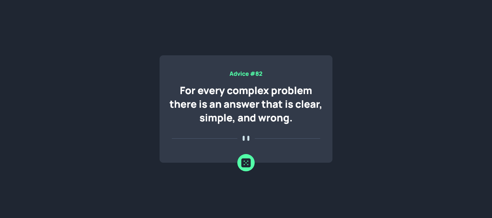
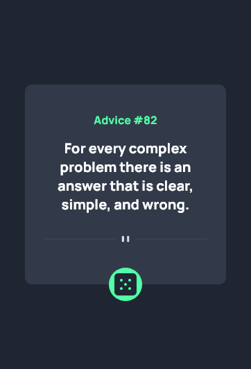

# Frontend Mentor - Advice generator app solution

This is a solution to the [Advice generator app challenge on Frontend Mentor](https://www.frontendmentor.io/challenges/advice-generator-app-QdUG-13db). Frontend Mentor challenges help you improve your coding skills by building realistic projects.

## Table of contents

- [Overview](#overview)
  - [The challenge](#the-challenge)
  - [Screenshot](#screenshot)
  - [Links](#links)
- [My process](#my-process)

  - [Built with](#built-with)
  - [What I learned](#what-i-learned)

- [Author](#author)

## Overview

### The challenge

Users should be able to:

- View the optimal layout for the app depending on their device's screen size
- See hover states for all interactive elements on the page
- Generate a new piece of advice by clicking the dice icon

### Screenshot

-Desktop UI  

 
 
-Mobile UI

### Links

- Solution URL: [Vercel](https://github.com/nitishkyadav7115/advice-generator-app)
- Live Site URL: [Github Repo](https://advice-generator-app-opal.vercel.app/)

### Built with

- Semantic HTML5 markup
- CSS custom properties
- Flexbox
- [React](https://reactjs.org/) - JS library

### What I learned

- Learned about Relative and Absolute Positioning in CSS

## Author

- Website - [https://www.nitishkyadav.me](https://www.nitishkyadav.me)
- Frontend Mentor - [@nitishkyadav7115](https://www.frontendmentor.io/profile/nitishkyadav7115)
- Twitter - [@nitish_yadav5](https://www.twitter.com/nitish_yadav5)
